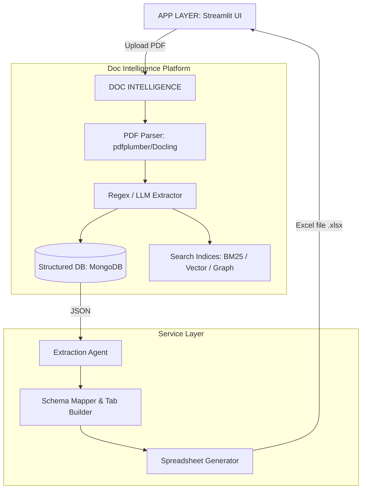
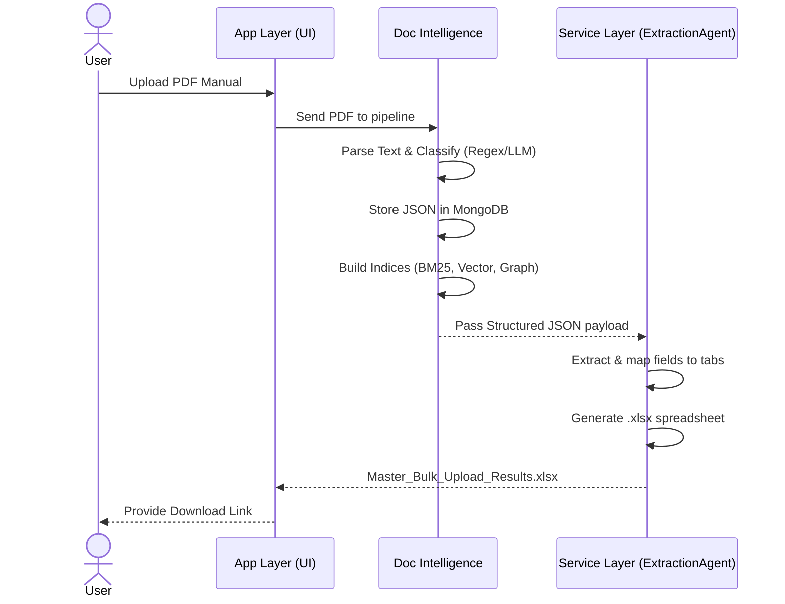

# Industrail_App: Enterprise Document Intelligence Platform


## 🌟 Production System Architecture
This repository contains the blueprints and the local demo of a **highly scalable, multi-engine Enterprise Document Intelligence Platform**.

In production, this system automates the extraction of complex industrial data from unstructured machine PDF manuals (fault guides, parameter sheets) into a structured 13-tab Master Bulk Upload spreadsheet. It processes unstructured PDFs through a 5-layer pipeline: Extract, Index, Search, Map, and Generate.

🚨 **[View the Interactive Production Dataflow Diagram Here](https://htmlpreview.github.io/?https://github.com/raghdaemara1/Industrail_App/blob/main/system_dataflow.html)** 🚨

*Please click the link above to see the full multi-engine architecture (Snowflake Cortex, Neo4j, OpenSearch, Azure Blob, MongoDB) that powers the production version of this tool.*

---

## 💻 Local Air-Gapped Demo (This Repository)

Because the full production stack requires expensive enterprise cloud resources, this repository is pre-configured with a **Free & Local Tool Stack** that mirrors the production architecture perfectly. This allows anyone to run and test the exact same dataflow logic locally, at zero cost.

## 📖 Overview

O3Sigma requires a comprehensive 13-tab Master Bulk Upload spreadsheet to configure each machine. Traditionally, engineers fill this out manually by reading through PDF manuals. **This application fully automates that workflow.**

It reads PDF documents, extracts every alarm and parameter record, intelligently classifies them into O3Sigma's fixed taxonomy using local or cloud LLMs, and outputs a ready-to-import `.xlsx` file. What used to take days now takes under **2 minutes**.

## 🚀 Key Features

*   **PDF Parsing**: robust layout-preserving extraction (using `pdfplumber` and `PyPDF2`).
*   **Intelligent Extraction & Classification**: Regex-first extraction with LLM fallback (Ollama or Groq free tier) to handle complex, messy PDF data.
*   **Database Integration**: Local MongoDB storage ensures continuous history, deduplication via document fingerprinting, and quick retrievals.
*   **Advanced Data Search**:
    *   *Keyword Search*: BM25 in-memory index for exact match search.
    *   *Semantic Search*: Vector DB using ChromaDB and Sentence-Transformers.
    *   *Knowledge Graph*: Relationship mapping between alarms, components, and machines using NetworkX.
*   **Automated Excel Generation**: Writes directly to a structured 13-tab Excel workbook using `openpyxl`.
*   **Global Fault Analytics**: Built-in Pandas + Scikit-Learn tools to detect anomalies and show downtime rates.

---

## 🏗️ Enterprise System Architecture

Our production environment utilizes a distributed, multi-engine architecture designed for maximum search performance and ML capabilities. We process unstructured PDFs through a 5-layer pipeline: Extract, Index, Search, Map, and Generate.

**Interactive Platform Diagram:** Please view the `system_dataflow.html` file in this repository (or via the link above) for the full 5-way parallel processing data flow.

### 1. High-Level Processing Flow

This diagram illustrates how the system layers interact with each other for data extraction and classification.



### 2. End-to-End Execution Pipeline

Here is the exact step-by-step process of how an uploaded PDF turns into structured data.



---

## ⚙️ Installation & Setup

You can run this entire stack locally with free tools.

### Prerequisites
* Python 3.12+ 
* Local MongoDB Community Edition (or Docker `mongo:7`)
* [Ollama](https://ollama.com/) installed locally (if using the local LLM option)

### Step-by-Step

1. **Clone and setup the environment:**
   ```bash
   python -m venv venv
   source venv/bin/activate  # Or `venv\Scripts\activate` on Windows
   pip install -r requirements.txt
   ```

2. **Start MongoDB:**
   * **Windows/Mac**: Make sure the MongoDB service is running.
   * **Docker**: `docker run -d --name mongo -p 27017:27017 mongo:7`

3. **Start Ollama (Optional, for local extraction):**
   ```bash
   ollama serve
   ollama pull llama3.2:3b
   ```

4. **Environment Variables:**
   Copy the example config and edit it if necessary (or create `.env` from scratch).
   ```bash
   cp .env.example .env
   ```
   *Make sure `MONGODB_URI` points to your local DB or Atlas cluster.*

5. **Run the application:**
   ```bash
   streamlit run app/app.py
   ```

---

## 🛠️ Technology Stack: Production vs. Local Demo

To deploy or test this application effortlessly, the architecture is fully swappable via the `.env` configuration.

This guarantees the application can run in a completely air-gapped environment while proving the exact same logic used in production.

| Component | Production Stack (Enterprise) | Local Demo Equivalent (This Repo) |
| :--- | :--- | :--- |
| **PDF Parsing** | LlamaParse / Docling | `pdfplumber` + `PyPDF2` fallback |
| **LLM Classification** | Cortex LLM / GPT-4 | `Ollama (llama3.2:3b)` or `Groq` API |
| **Structured Database**| MongoDB Atlas | Local MongoDB Community |
| **File Object Store**| Azure Blob Storage | Local filesystem (`pdf_store`) |
| **Keyword Search** | AWS OpenSearch | `rank_bm25` (In-memory Python) |
| **Semantic Search**| Cortex / k-NN | `chromadb` + `sentence-transformers` |
| **Graph Database** | Neo4j | `networkx` (In-memory graph) |
| **Analytics Engine** | Snowflake Cortex AI | `scikit-learn` + `pandas` |

---

## 📝 Usage

1. **Upload & Process:** Open the app and go to the first tab. Set your target Machine Name, upload the PDF, and click **Extract Data & Generate**. The app will provide live trace logs of the extraction via LLM/Regex.
2. **Download Excel:** Once completed, a button to download the `Master_Bulk_Upload_Results.xlsx` file will appear.
3. **Search & Review:** Use the second tab to search your knowledge base of alarms (using Keyword, Semantic Vector, or Graph mappings).
4. **History & Analytics:** Head to the third tab to view previously uploaded files, delete cached memory, and review global fault analytics.

---

## 👤 Development & Maintenance

* **Configuration**: Key behaviors and thresholds are controlled in `.env` and `config.py`.
* **Adding new Excel Tabs**: Driven through `core/phase_engine.py` and defined within `schemas.py` without requiring massive structural changes.
